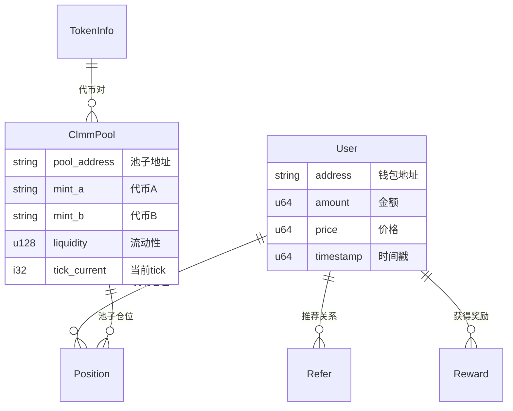

# Coinfair Solana Backend

一个基于 **Rust** 的高性能去中心化交易所(DEX)后端系统，专注于 Solana 区块链生态系统的 DeFi 交换服务。

## 🏗️ 项目架构

### 核心技术栈
- **语言**: Rust (高性能、内存安全)
- **数据库**: MongoDB (文档型数据库，灵活的数据模型)
- **Web框架**: Axum (现代异步HTTP框架)
- **区块链**: Solana + Raydium (DEX协议集成)
- **文档**: OpenAPI/Swagger (自动化API文档)
- **认证**: JWT + Solana钱包签名
- **容器化**: Docker + Docker Compose

### 系统架构图

```
┌─────────────────────────────────────────────────────────────┐
│                    Coinfair Backend                         │
├─────────────────────────────────────────────────────────────┤
│  ┌─────────────┐  ┌─────────────┐  ┌─────────────┐         │
│  │   Monitor   │  │   Server    │  │  Telegram   │         │
│  │   (监控)     │  │  (API服务)   │  │   (机器人)   │         │
│  └─────────────┘  └─────────────┘  └─────────────┘         │
│         │                │                │                │
│         └────────────────┼────────────────┘                │
│                          │                                 │
│  ┌─────────────────────────────────────────────────────────┤
│  │              Services Layer (业务层)                     │
│  │  ┌─────────────┐ ┌─────────────┐ ┌─────────────────────┐ │
│  │  │   Solana    │ │  User/Refer │ │     Permission      │ │
│  │  │   Service   │ │   Service   │ │      Service        │ │
│  │  └─────────────┘ └─────────────┘ └─────────────────────┘ │
│  └─────────────────────────────────────────────────────────┤
│  ┌─────────────────────────────────────────────────────────┤
│  │              Database Layer (数据层)                     │
│  │  ┌─────────────┐ ┌─────────────┐ ┌─────────────────────┐ │
│  │  │    User     │ │    Pool     │ │     Position        │ │
│  │  │   Models    │ │   Models    │ │      Models         │ │
│  │  └─────────────┘ └─────────────┘ └─────────────────────┘ │
│  └─────────────────────────────────────────────────────────┤
│                            │                               │
│  ┌─────────────────────────────────────────────────────────┤
│  │                  MongoDB Database                       │
│  └─────────────────────────────────────────────────────────┘
└─────────────────────────────────────────────────────────────┘
```

## 📦 工作空间结构

项目采用 Rust 工作空间架构，按功能模块化分离：

```
crates/
├── coinfair/           # 🚀 主应用程序入口，协调所有服务
├── server/             # 🌐 REST API服务器 (Axum + OpenAPI)
├── database/           # 🗄️ MongoDB数据层 (Models + Repositories)
├── solana/             # ⚡ Solana区块链集成
│   ├── clmm/          # 集中流动性做市商(CLMM)智能合约
│   ├── clmm-client/   # CLMM客户端工具
│   ├── cpmm/          # 恒定乘积做市商(CPMM)智能合约
│   ├── cpmm-client/   # CPMM客户端工具
│   └── referral/      # 推荐系统智能合约
├── dex/                # 📈 DEX特定业务逻辑
├── monitor/            # 👁️ 区块链事件监控
├── telegram/           # 🤖 Telegram机器人界面
├── timer/              # ⏰ 定时任务调度
└── utils/              # 🛠️ 共享工具库
```

## 🚀 快速开始

### 环境要求
- Rust 1.70+ 
- Docker & Docker Compose
- MongoDB (通过Docker)

### 安装步骤

1. **克隆项目**
   ```bash
   git clone <repository-url>
   cd Coinfair-Solana-Backend
   ```

2. **启动数据库**
   ```bash
   docker-compose up -d
   ```

3. **环境配置**
   ```bash
   # 开发环境 (推荐)
   make dev
   
   # 或手动启动
   CARGO_ENV=development RUST_LOG=debug cargo run --bin coinfair
   ```

4. **验证部署**
   ```bash
   # 健康检查
   curl http://127.0.0.1:8000/api/v1
   
   # 查看API文档
   open http://127.0.0.1:8000/swagger-ui
   ```

## 🎯 核心功能

### 1. DeFi 交换服务

**多池子类型支持**:
- **CLMM** (集中流动性) - 高效的价格区间做市
- **CPMM** (恒定乘积) - 传统AMM模式  
- **CP-Swap** - 恒定价格交换

**智能交换特性**:
```rust
// 智能交换示例
let result = raydium_swap.smart_swap(
    "So11111111111111111111111111111111111111112", // SOL
    "EPjFWdd5AufqSSqeM2qN1xzybapC8G4wEGGkZwyTDt1v", // USDC
    pool_address,
    1_000_000_000, // 1 SOL
    Some(50),      // 0.5% 滑点
    Some(500),     // 5% 最大价格影响
).await?;
```

### 2. 高级流动性管理

**仓位管理**:
- 开仓/平仓操作
- 流动性增减
- 收益收取
- NFT仓位代币化

**价格计算**:
- 精确的AMM算法实现
- 实时价格影响评估
- 智能滑点保护

### 3. 企业级权限系统

**多维度权限控制**:
- 用户等级管理 (Basic/Premium/VIP/Admin)
- API路由级权限
- 操作类型权限 (读取/写入/管理)
- 速率限制集成

**认证方式**:
- JWT Token认证
- Solana钱包签名验证
- Redis缓存的会话管理

### 4. 推荐奖励系统

**多级推荐**:
- 推荐关系追踪
- 自动奖励分发
- NFT铸造奖励
- 交易返佣机制

## 🌐 API接口

### 主要路由结构

```
/api/v1/                          # 系统健康检查
├── user/                         # 用户管理
├── refer/                        # 推荐系统  
├── reward/                       # 奖励管理
├── solana/                       # Solana区块链接口
│   ├── swap/                     # 代币交换
│   ├── pool/                     # 池子管理
│   ├── position/                 # 仓位操作
│   ├── main/                     # 静态配置
│   └── mint/                     # 代币信息
└── admin/permissions/            # 权限管理 (管理员)

# 文档接口
/api-docs                         # API规格说明
/swagger-ui                       # 交互式文档界面
```

### 核心API示例

```bash
# 系统状态
curl http://127.0.0.1:8000/api/v1

# 代币交换
curl -X POST http://127.0.0.1:8000/api/v1/solana/swap \
  -H "Content-Type: application/json" \
  -d '{
    "input_mint": "So11111111111111111111111111111111111111112",
    "output_mint": "EPjFWdd5AufqSSqeM2qN1xzybapC8G4wEGGkZwyTDt1v",
    "amount": 1000000000,
    "slippage": 0.005
  }'

# 池子查询
curl "http://127.0.0.1:8000/api/v1/solana/pools/info/list?page=1&limit=20"

# 流动性分布图
curl "http://127.0.0.1:8000/api/v1/solana/pools/line/id?id=<pool_address>"
```

## 🛠️ 开发工具

### Make命令 (推荐)

```bash
make dev          # 开发环境启动
make prod         # 生产环境启动  
make test         # 运行测试
make build        # 构建项目
make build-release # 发布构建
make login        # AWS服务器登录
make sync         # 远程文件同步
```

### 基础Cargo命令

```bash
# 开发
cargo build
cargo test
cargo run --bin coinfair

# 格式化 & 质量检查
cargo fmt
cargo clippy
cargo check
```

### 数据库管理

```bash
# 启动MongoDB服务
docker-compose up -d

# MongoDB管理界面
open http://localhost:8081
# 用户名: admin, 密码: pass

# 数据库命令行
docker exec -it mongodb mongosh coinfair_development
```

## 📊 数据模型

### 核心实体关系



### 主要集合

- **User**: 用户钱包地址和交易记录
- **Refer**: 用户推荐关系网络
- **Reward**: 奖励分发和状态跟踪
- **ClmmPool**: CLMM池子状态和配置
- **Position**: 用户流动性仓位记录
- **TokenInfo**: 代币元数据和价格信息

## ⚡ 性能特性

### 高性能设计

- **异步架构**: 全异步IO，支持高并发
- **内存安全**: Rust零成本抽象，无GC延迟
- **数据库优化**: MongoDB索引优化，分页查询
- **连接池**: 复用数据库连接，减少开销

### 可靠性保障

- **错误处理**: anyhow统一错误管理
- **日志系统**: tracing结构化日志
- **优雅关闭**: 信号处理和资源清理
- **健康检查**: 系统状态监控

### 扩展性设计

- **微服务架构**: 模块化crate设计
- **水平扩展**: 无状态服务设计
- **负载均衡**: 支持多实例部署
- **缓存策略**: Redis缓存热点数据

## 🔧 配置管理

### 环境变量

```bash
# 应用配置
CARGO_ENV=development              # 运行环境
APP_HOST=0.0.0.0                  # 服务主机
APP_PORT=8000                     # 服务端口

# 数据库配置  
MONGO_URI=mongodb://localhost:27017
MONGO_DB=coinfair_development

# Solana配置
RPC_URL=https://api.devnet.solana.com
PRIVATE_KEY=your_private_key_here
RAYDIUM_PROGRAM_ID=CAMMCzo5YL8w4VFF8KVHrK22GGUsp5VTaW7grrKgrWqK

# 日志配置
RUST_LOG=info
```

### 环境文件

- `.env.development` - 开发环境 (devnet, 调试日志)
- `.env.production` - 生产环境 (mainnet, 性能优化)

## 🔍 监控和日志

### 日志系统

项目使用 `tracing` 框架提供结构化日志:

```rust
info!("🚀 服务启动成功，监听端口: {}", port);
warn!("⚠️ 检测到异常网络延迟: {}ms", latency);
error!("❌ 交换交易失败: {}", error);
```

### 监控指标

- **系统健康**: 服务状态、响应时间
- **业务指标**: 交换量、池子状态、用户活跃度
- **区块链指标**: 交易成功率、Gas消耗、区块高度
- **数据库指标**: 连接池状态、查询性能

## 🧪 测试

### 测试策略

```bash
# 单元测试
cargo test --package solana
cargo test --package server

# 集成测试
cargo test test_raydium_swap_calculation
cargo test test_clmm_operations

# 带日志的测试
cargo test -- --nocapture
```

### API测试

项目提供 Postman 集合和自动化测试脚本:
- `tests/Coinfair_Token_API_Tests.postman_collection.json`
- `tests/analyze_rate_limit.sh`
- `tests/test_token_apis.sh`

## 🚀 部署

### 本地部署

```bash
# 开发环境
make dev

# 生产模式
make prod
```

### Docker部署

```bash
# 构建镜像
docker build -t coinfair-backend .

# 运行容器
docker run -p 8000:8000 coinfair-backend
```

### AWS部署

```bash
# 登录服务器
make login

# 构建发布版本
make build-release

# 同步文件
make sync
```

## 🤝 贡献指南

### 开发流程

1. Fork项目并创建功能分支
2. 遵循项目代码风格 (`rustfmt.toml`)
3. 添加必要的测试用例
4. 确保所有测试通过: `cargo test`
5. 提交PR并等待代码审查

### 代码规范

- 使用 `cargo fmt` 格式化代码
- 使用 `cargo clippy` 检查代码质量
- 遵循 Rust 官方编程规范
- 添加必要的文档注释

## 📄 许可证

本项目采用 MIT 许可证 - 查看 [LICENSE](LICENSE) 文件了解详情。

## 🙋‍♂️ 支持

- **文档**: 访问 `/swagger-ui` 查看完整API文档
- **问题反馈**: 通过GitHub Issues提交问题
- **功能请求**: 欢迎提交功能改进建议

---

**🚀 Coinfair - 构建下一代DeFi交易基础设施**